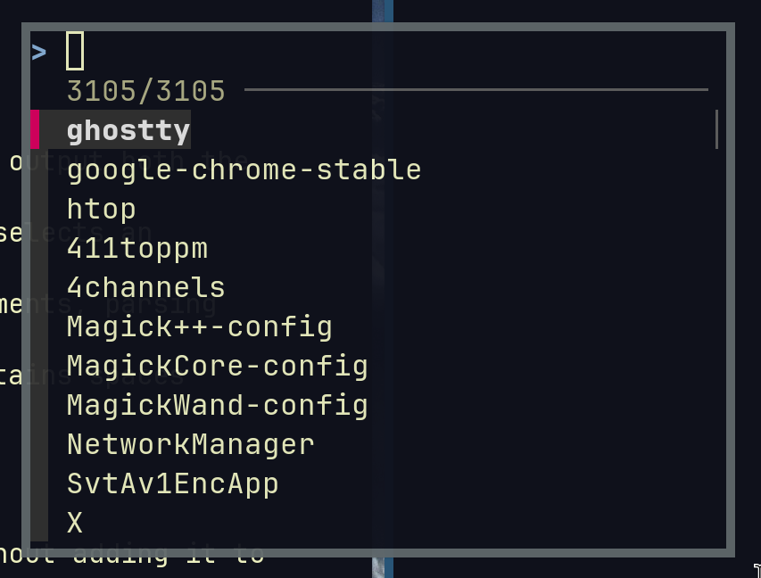

# Fling - Fast Application Launcher

A lightweight TUI application launcher for Linux.
Inspired by the power of `fzf` and the likeness of `dmenu` and `rofi`.



## Features

- Fast fuzzy search through system applications
- Scans all PATH directories for executables
- Integrates seamlessly with i3wm
- Lightweight and responsive TUI interface
- No shell script dependencies - pure Go implementation

## Installation

```bash
make build
sudo make install
```

Or manually:
```bash
go build -o fling
sudo cp fling /usr/local/bin/
```

## Usage

### Basic usage
```bash
fling
```

### i3wm Integration

Add this to your i3 config (`~/.config/i3/config`):

```
bindsym $mod+d exec --no-startup-id alacritty --class fling -e fling
for_window [class="fling"] floating enable, resize set 800 600, move position center
```

This will:
- Bind `Mod+d` to launch fling in a floating alacritty terminal
- Set the window to 800x600 pixels and center it on screen

## How it works

1. `fling` scans all directories in the PATH environment variable
2. Finds all executable files and presents them via `fzf` for interactive selection
3. Selected applications are launched with proper process detachment

## Building from Source

```bash
git clone <repository>
cd fling
go mod tidy
make build
```
